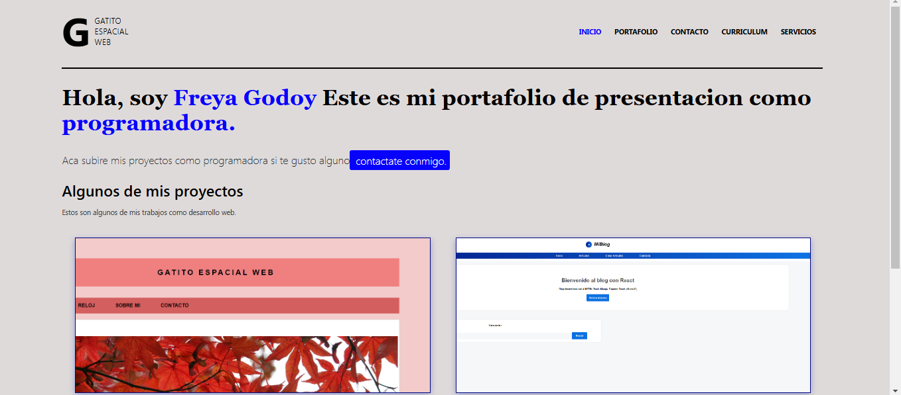
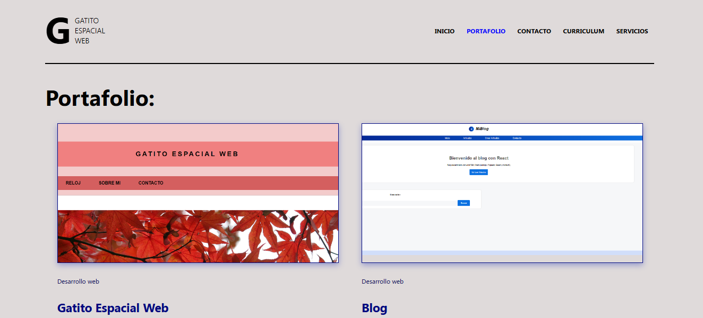
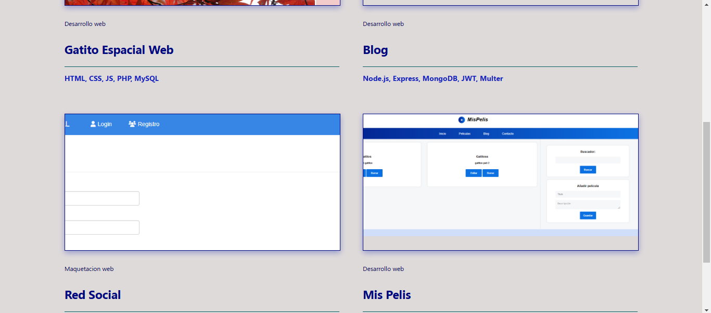

# Pagina web - portfolio 📁

Este proyecto es una página web estática desarrollada en React, enfocada en servir como un portfolio personal. Permite mostrar tus proyectos y brindar a los visitantes una forma sencilla de contactarte.
La información en el sitio es completamente estática, es decir, no utiliza una base de datos ni genera contenido dinámico.

## Tabla de Contenidos

- [Características](#caracteristicas)
- [Tecnologías](#tecnologias)
- [Instalación](#instalacion)
- [Interfaz](#interfaz)
- [Despliegue](#despliegue)
- [Contacto](#contacto)

## Características 💬 <a id="caracteristicas"></a>

- Contiene barra de navegación. 👆

- Enlaces. 🔗

- Formulario para contacto. 📲

## Tecnologías 🌐 <a id="tecnologias"></a>

- **React**: Biblioteca para la construcción de la interfaz de usuario.
- **React Router DOM**: Manejo de rutas para la navegación entre secciones.
- **Hooks de React**

Antes de instalar, descargue e instale Node.js.☑️

1. Clona el repositorio:

```bash
  git clone https://github.com/freya-godoy/Red-Social-Backend.git
```

2. Instala dependencias del proyecto:

```sh
npm install
```

## Interfaz pagina web 📲 <a id="interfaz"></a>

Inicio del Portfolio 📰



Muestra del Portfolio ⬇️





## Despliegue 📂 <a id="despliegue"></a>

Despliegue desde la consola:

```sh
npm start
```

## Contribuciones 👇

¡Las contribuciones son bienvenidas! Sigue estos pasos:

1. Haz un fork del repositorio.
2. Crea una rama nueva: `git checkout -b nueva-rama`.
3. Realiza tus cambios y haz un commit: `git commit -m "Descripción"`.
4. Sube los cambios: `git push origin nueva-rama`.
5. Abre un Pull Request.

## Contacto 📬 <a id="contacto"></a>

- Email: freya.godoy.20@hotmail.com
